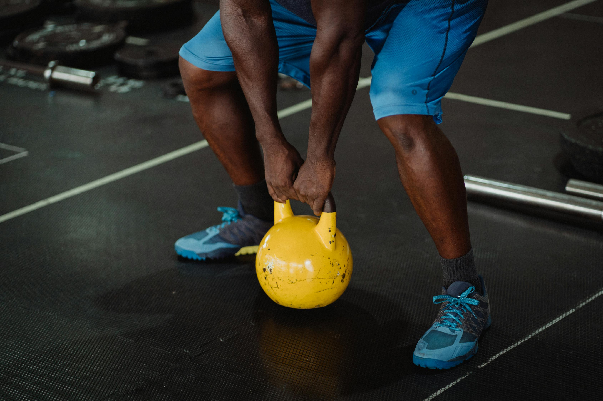

## Kettlebell

A **kettlebell** is a versatile piece of workout equipment shaped like a cannonball with a handle. It originated in Russia and has been used for centuries as a tool for building strength, endurance, and flexibility. Kettlebells come in various weights, making them suitable for beginners and advanced fitness enthusiasts alike.

The unique design of the kettlebell, with its off-center weight distribution, challenges your body differently than traditional dumbbells or barbells. This feature makes kettlebells particularly effective for dynamic and functional movements.

## Benefits of Using a Kettlebell

| **Benefit**               | **Description**                                                                 |
|---------------------------|---------------------------------------------------------------------------------|
| **Full-Body Workouts**     | Kettlebell exercises engage multiple muscle groups for strength and cardio.     |
| **Improves Functional Strength** | Mimics real-life activities, enhancing everyday performance.                  |
| **Boosts Cardiovascular Fitness** | High-intensity movements elevate heart rate, improving cardiovascular health. |
| **Enhances Core Stability** | Requires core engagement for balance and control during exercises.              |
| **Compact and Portable**   | Small and easy to store, ideal for home or on-the-go workouts.                  |

### Kettlebell Full-body workout

| **Exercise**               | **Description**                           | **Benefit**                        |
|----------------------------|-------------------------------------------|------------------------------------|
| **Squat**                  | Squat holding the kettlebell at chest.    | Builds leg and core strength.      |
| **Bent Over Row**          | Mimics drawing water; lift kettlebell.    | Strengthens back and arms.         |
| **Romanian Deadlift**      | Lift kettlebell from floor upright.       | Targets hamstrings and glutes.     |
| **Wide Squat**             | Squat with wider stance holding kettlebell.| Strengthens inner thighs.          |
| **Upright Row**            | Lift kettlebell to chest height.          | Builds shoulders and traps.        |
| **Curl, Press, Extend**    | Curl to chest, press overhead, extend back.| Strengthens arms and shoulders.    |
| **Plank on Kettlebell**    | Push-up position with hands on kettlebell.| Builds core and stability.         |
| **Glute Bridges**          | Lift hips with kettlebell on pelvis.      | Strengthens glutes and back.       |
| **Chest Press**            | Press kettlebell up from chest.           | Strengthens chest and shoulders.   |
| **Alt Staggered Push-Ups** | Push-ups with one hand on kettlebell.     | Builds arms and balance.           |
| **Dead Bugs**              | Alternate straightening legs with kettlebell.| Strengthens core and balance.      |
| **Kettlebell Pull-Over**   | Move kettlebell overhead to the floor.    | Builds back and shoulder mobility. |

*Note: The above exercises can be seen [here](https://youtu.be/stx7PYeoMao){:target="_blank"}.*

