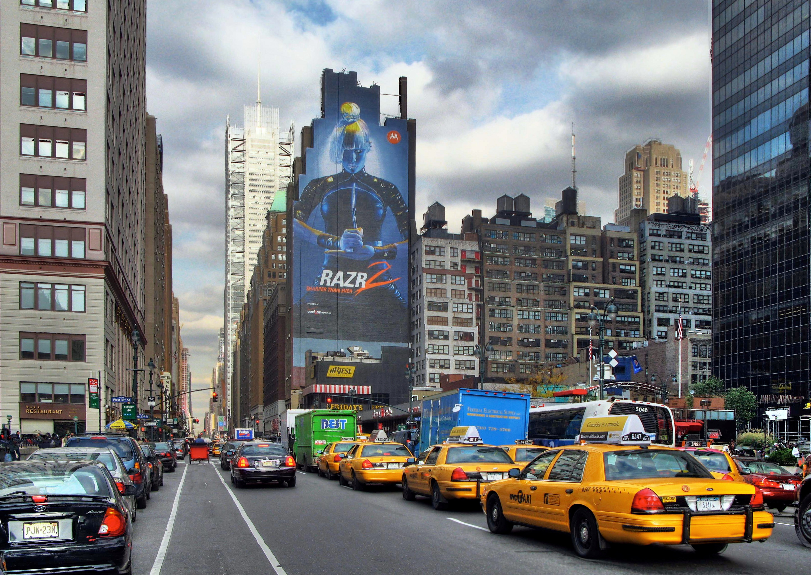
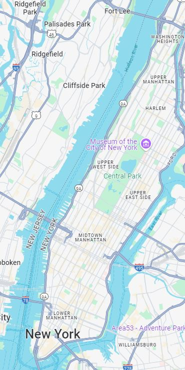

## **Manhattan Grid System**

The **Manhattan Grid System** is a planned urban layout designed to simplify navigation and optimize the use of land in Manhattan, New York City. Adopted in 1811 as part of the Commissioners' Plan, it is one of the most famous examples of urban planning.

### **Key Features of the Grid System**

1. **North-South Streets:**
   - Streets run horizontally and are numbered sequentially from south to north.
   - Most streets are laid out in a regular, parallel pattern.
   - The blocks between streets are relatively uniform, with each block spanning approximately **264 feet (~80 meters)**.

2. **East-West Avenues:**
   - Avenues run vertically and are spaced farther apart than streets.
   - Avenues are also numbered, starting from 1st Avenue on the east side and moving westward.
   - The distance between avenues averages **750 to 920 feet (~244 to 280 meters)**.

3. **Neighborhood Variations:**
   - **Downtown Manhattan (below 14th Street):** The grid system is less regular, with winding streets that reflect earlier, unplanned urban development.
   - **Midtown and Uptown Manhattan (above 14th Street):** The grid becomes highly consistent, making navigation straightforward.

4. **Exceptions:**
   - Certain streets, like Broadway, cut diagonally through the grid, creating iconic intersections such as Times Square.
   - Some streets, like Park Avenue and Central Park West, have specific names instead of numbers.

### **Practical Benefits of the Grid System**
- **Ease of Navigation:** The consistent numbering of streets and avenues makes finding locations intuitive.
- **Scalability:** The system allowed Manhattan to grow rapidly while maintaining order.
- **Distance Estimation:** The uniformity of block lengths allows for easy estimation of distances:
  - 20 street blocks (north-south) ≈ 1 mile.
  - ~6 avenue blocks (east-west) ≈ 1 mile.

### **Cultural and Historical Significance**
- The grid system symbolizes New York City's efficiency and practicality.
- It reflects the foresight of planners who anticipated the city's rapid growth.
- Iconic landmarks, such as Central Park, fit seamlessly within the grid.

### **Distance Table: Manhattan Grid System**

| **Type of Distance**         | **US System (feet)** | **US System (miles)** | **Metric System (meters)** | **Metric System (kilometers)** |
|-------------------------------|----------------------|------------------------|----------------------------|---------------------------------|
| **Distance Between Streets**  | ~264 feet           | ~0.05 miles           | ~80 meters                 | ~0.08 kilometers               |
| **Distance Between Avenues**  | ~800 feet           | ~0.15 miles           | ~244 meters                | ~0.24 kilometers               |
| **1 Mile (North-South)**      | 20 street blocks    | 1 mile                | ~1,609 meters              | 1.609 kilometers               |
| **1 Mile (East-West)**        | ~6 avenue blocks    | 1 mile                | ~1,609 meters              | 1.609 kilometers               |

---

## **Manhattan Avenues**

### **Primary Avenues**

| **Numbered Avenue** | **Name (If Applicable)**            | **General Location**                             | **Key Landmarks or Notes**                          |
|----------------------|-------------------------------------|-------------------------------------------------|---------------------------------------------------|
| **1st Avenue**       | N/A                                | East Side, parallel to FDR Drive                | United Nations Headquarters                        |
| **2nd Avenue**       | N/A                                | East Side, parallel to 1st Avenue               | Sutton Place, numerous restaurants                 |
| **3rd Avenue**       | N/A                                | East Side, parallel to 2nd Avenue               | Murray Hill, Kips Bay                              |
| **4th Avenue**       | Park Avenue South (after 14th St)  | East Side (briefly exists as 4th Ave)           | Union Square (near southern tip of Park Avenue South) |
| **5th Avenue**       | N/A                                | Central dividing line of Manhattan              | Empire State Building, Central Park               |
| **6th Avenue**       | Avenue of the Americas             | West Side, runs parallel to 5th Avenue          | Bryant Park, Radio City Music Hall                |
| **7th Avenue**       | Adam Clayton Powell Jr. Blvd (Uptown) | West Side, runs parallel to 6th Avenue          | Times Square, Fashion District                    |
| **8th Avenue**       | Frederick Douglass Blvd (Uptown)   | West Side, parallel to 7th Avenue               | Port Authority Bus Terminal                       |
| **9th Avenue**       | Columbus Avenue (Uptown)           | West Side, parallel to 8th Avenue               | Hell’s Kitchen, Lincoln Center                    |
| **10th Avenue**      | Amsterdam Avenue (Uptown)          | West Side, parallel to 9th Avenue               | High Line, Chelsea Market                         |
| **11th Avenue**      | West End Avenue (Uptown)           | West Side, parallel to 10th Avenue              | Intrepid Sea, Air & Space Museum                  |
| **12th Avenue**      | West Side Highway                  | Westernmost side, near Hudson River             | Hudson River Greenway                             |

### **Additional Manhattan Avenues**

| **Avenue Name**     | **Location**                                   | **Description and Key Features**                                                                                                 | **Notable Landmarks or Notes**                           |
|---------------------|-----------------------------------------------|-------------------------------------------------------------------------------------------------------------------------------|---------------------------------------------------------|
| **Lexington Avenue**| Runs parallel to 3rd and Park Avenues (East Side). | Begins at **East 21st Street** and extends north to **East 131st Street**.                                                        | Known for its commercial and residential mix, Grand Central Terminal vicinity. |
| **Park Avenue**     | Formerly part of 4th Avenue; parallel to Lexington and Madison Avenues. | Starts at **Union Square** (as Park Avenue South) and extends north of **42nd Street** through the Upper East Side to Harlem.   | Home to some of the wealthiest real estate in NYC, Grand Central Terminal, Park Avenue Viaduct. |
| **Madison Avenue**  | Located between 5th Avenue and Park Avenue.   | Begins at **East 23rd Street** and runs north to **Madison Avenue Bridge** (138th Street).                                       | Iconic for luxury fashion boutiques, advertising agencies, and cultural institutions. |

1. **Not Part of the Grid:**
   - Lexington, Park, and Madison Avenues are unique in that they do not conform to the typical numbered avenue layout.

2. **Historical Background:**
   - **Park Avenue** was originally part of 4th Avenue and was renamed to reflect its more affluent, park-like character as it developed.
   - **Madison Avenue** was named after Madison Square Park, reflecting its location near the park at its southern end.
   - **Lexington Avenue** was added later in Manhattan's development to provide an additional thoroughfare between 3rd and Park Avenues.

3. **Characteristics:**
   - **Lexington Avenue:** Known for being a major commercial corridor on the East Side, especially around Midtown.
   - **Park Avenue:** Synonymous with wealth and luxury, hosting iconic skyscrapers and residential properties.
   - **Madison Avenue:** Famous for its advertising agencies (origin of the term "Madison Avenue" as shorthand for the advertising industry) and high-end shopping.

4. **Geographic Context:**
   - These avenues are located primarily on the **East Side of Manhattan**, with Park Avenue running through some of the most exclusive neighborhoods, such as Midtown, the Upper East Side, and Harlem.

### **Other Named Avenues in Manhattan**

| **Avenue Name**       | **Location**                                   | **Description and Key Features**                                                                                                  | **Notable Landmarks or Notes**                     |
|-----------------------|-----------------------------------------------|-------------------------------------------------------------------------------------------------------------------------------|---------------------------------------------------|
| **Broadway**           | Runs diagonally from Bowling Green to Inwood | The most famous thoroughfare in Manhattan, cutting diagonally through the grid system.                                           | Times Square, Broadway Theaters, Flatiron Building |
| **Central Park West**  | West of Central Park                         | A scenic avenue along Central Park’s western edge, featuring luxury residential buildings.                                       | American Museum of Natural History                |
| **Columbus Avenue**    | Continuation of 9th Avenue (Uptown)          | Runs north from W 59th St to W 110th St, serving the Upper West Side.                                                           | Lincoln Center, Central Park proximity            |
| **Amsterdam Avenue**   | Continuation of 10th Avenue (Uptown)         | Runs from W 59th St to W 190th St, mainly residential and commercial.                                                           | Cathedral of St. John the Divine                  |
| **West End Avenue**    | Continuation of 11th Avenue (Uptown)         | Quiet, residential avenue on the Upper West Side, running parallel to the Hudson River.                                         | High-rise apartments, Riverside Park              |
| **Riverside Drive**    | Follows the Hudson River (West Side)         | Scenic, curving street overlooking the Hudson River from 72nd Street to Inwood.                                                 | Riverside Park, Grant's Tomb                      |
| **FDR Drive**          | East Side along the East River               | A highway-like roadway that runs along the East River, serving as a major connector for northern and southern Manhattan.         | Queensboro Bridge, East River Greenway            |
| **Broad Street**       | Financial District                           | A historic street in Lower Manhattan that intersects Wall Street.                                                              | New York Stock Exchange                           |
| **The Bowery**         | Runs diagonally from Chinatown to East Village | One of Manhattan’s oldest streets, now known for trendy spots and historical significance.                                       | Bowery Ballroom                                   |
| **Allen Street**       | Lower East Side                              | A short street connecting the East Village and Lower East Side, with a pedestrian and bike-friendly median.                     | Trendy bars and restaurants                       |
| **Avenue A**           | Alphabet City (East Village)                | Runs parallel to 1st Avenue, part of Alphabet City.                                                                              | Tompkins Square Park                              |
| **Avenue B**           | Alphabet City (East Village)                | Runs parallel to Avenue A, also part of Alphabet City.                                                                           | Community gardens                                 |
| **Avenue C**           | Alphabet City (East Village)                | Residential and commercial street in Alphabet City, further east.                                                              | East River Park                                   |
| **Avenue D**           | Alphabet City (East Village)                | The easternmost avenue in Alphabet City.                                                                                        | Community-focused with cultural influences        |
| **St. Nicholas Avenue**| Harlem and Washington Heights               | Runs diagonally from 110th St to 193rd St.                                                                                      | Historically significant area                     |
| **Pleasant Avenue**    | East Harlem                                 | A short residential street extending from E 114th St to E 120th St.                                                             | Known for its Italian-American heritage           |
| **Edgecombe Avenue**   | Harlem and Washington Heights               | Runs along the western edge of Highbridge Park, primarily residential.                                                          | Highbridge Park                                   |

1. **Diagonal Avenues:**
   - **Broadway**: Cuts across the Manhattan grid diagonally and is the longest avenue, spanning the entire borough.
   - **The Bowery**: A short diagonal street, historically significant, connecting the East Village and Lower East Side.

2. **Scenic Drives:**
   - **Riverside Drive** and **Central Park West** offer some of the most scenic views in Manhattan, making them desirable residential streets.
   - **FDR Drive**: More of a highway than a traditional avenue but functions as a vital connection along the East Side.

3. **Alphabet City Avenues:**
   - Avenues **A, B, C, and D** are unique to the Alphabet City section of the East Village, further east of 1st Avenue.

4. **Named Continuations of Numbered Avenues:**
   - Several numbered avenues adopt new names when moving northward (e.g., **Columbus Avenue**, **Amsterdam Avenue**, **West End Avenue**).

---