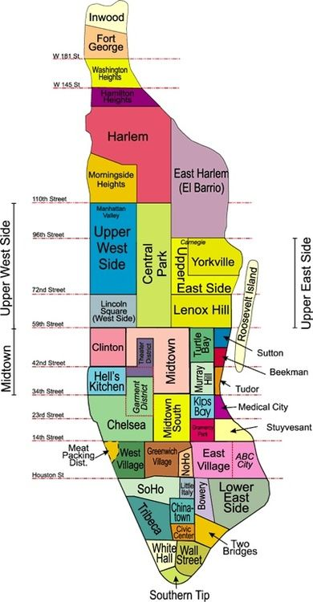

## **Manhattan – the island that never sleeps, where dreams reach for the sky!**

Manhattan is the heart of New York City, known for its iconic skyline, vibrant neighborhoods, and central role in finance, arts, and culture. Often considered the city’s cultural and economic hub, Manhattan is home to world-famous landmarks like Times Square, Central Park, and Wall Street. It is divided into numerous neighborhoods, each with its own distinct character and charm.

### **Neighborhoods in the Upper West Side**

| **Neighborhood**    | **Key Features**                                                                 | **Notable Landmarks**                    | **Approx. Location**                    | **East/West/Across**    |
|----------------------|----------------------------------------------------------------------------------|------------------------------------------|------------------------------------------|-------------------------|
| **Lincoln Square**   | Cultural hub with upscale living and performing arts.                           | Lincoln Center, Juilliard School         | W 59th St to W 66th St; Columbus Ave     | West                   |

### **Neighborhoods in Midtown Manhattan**

| **Neighborhood**    | **Key Features**                                                                 | **Notable Landmarks**                    | **Approx. Location**                    | **East/West/Across**    |
|----------------------|----------------------------------------------------------------------------------|------------------------------------------|------------------------------------------|-------------------------|
| **Clinton (Hell’s Kitchen)** | Vibrant area with trendy restaurants and theaters.                             | Intrepid Museum, Broadway theaters       | W 34th St to W 59th St; 8th Ave to Hudson River | West                   |
| **Theater District** | Center of NYC’s Broadway theaters and performances.                              | Times Square, Broadway                   | W 42nd St to W 53rd St; 6th Ave to 8th Ave | West                   |
| **Turtle Bay**       | Upscale residential area with proximity to the United Nations.                   | United Nations, Tudor City Gardens       | E 42nd St to E 53rd St; 1st Ave to 3rd Ave | East                   |
| **Murray Hill**      | Residential neighborhood with young professionals and historic charm.            | Morgan Library & Museum                  | E 34th St to E 40th St; Madison Ave to 3rd Ave | East                   |
| **Kips Bay**         | Quiet residential area with waterfront views and dining.                        | Kips Bay Towers                          | E 23rd St to E 34th St; 2nd Ave to FDR Dr | East                   |
| **Tudor City**       | Historic enclave known for its charming architecture and serene atmosphere.      | Tudor City Overpass                      | E 40th St to E 43rd St; 1st Ave to 2nd Ave | East                   |
| **Beekman**          | Small residential area with luxury living and riverfront views.                 | Beekman Tower                            | E 49th St to E 51st St; FDR Dr           | East                   |
| **Sutton Place**     | Exclusive area with elegant townhouses and serene streets.                      | Sutton Place Park                        | E 53rd St to E 59th St; 1st Ave to East River | East                   |

### **Neighborhoods in Gramercy and Stuyvesant Town**

| **Neighborhood**    | **Key Features**                                                                 | **Notable Landmarks**                    | **Approx. Location**                    | **East/West/Across**    |
|----------------------|----------------------------------------------------------------------------------|------------------------------------------|------------------------------------------|-------------------------|
| **Gramercy Park**    | Exclusive neighborhood with historic homes and private park access.             | Gramercy Park, National Arts Club        | E 20th St to E 23rd St; Park Ave South to 3rd Ave | East                   |
| **Stuyvesant Town**  | Large residential complex with green spaces.                                    | Stuyvesant Oval                          | E 14th St to E 23rd St; 1st Ave to FDR Dr | East                   |

### **Neighborhoods in Greenwich Village and Surroundings**

| **Neighborhood**    | **Key Features**                                                                 | **Notable Landmarks**                    | **Approx. Location**                    | **East/West/Across**    |
|----------------------|----------------------------------------------------------------------------------|------------------------------------------|------------------------------------------|-------------------------|
| **West Village**     | Charming area with cobblestone streets, boutique shops, and a vibrant nightlife.| Stonewall Inn, Hudson River Park         | Houston St to W 14th St; Hudson River to 7th Ave | West                   |
| **Greenwich Village**| Historic arts and bohemian neighborhood with cultural landmarks.                 | Washington Square Park, NYU              | Houston St to W 14th St; 6th Ave to 3rd Ave | Across                 |
| **NoHo**             | Small, trendy area with historic architecture and modern dining.                 | Astor Place                              | E 8th St to Houston St; Bowery to Broadway | East                   |
| **East Village**     | Diverse neighborhood with vibrant nightlife and artistic culture.               | Tompkins Square Park                     | Houston St to E 14th St; 1st Ave to Bowery | East                   |
| **ABC City (Alphabet City)**| Sub-neighborhood of East Village with eclectic culture and community gardens.         | Community Gardens, Tompkins Square Park  | Houston St to E 14th St; Ave A to Ave D    | East                   |

### **Neighborhoods in Chinatown, Little Italy, and Surroundings**

| **Neighborhood**    | **Key Features**                                                                 | **Notable Landmarks**                    | **Approx. Location**                    | **East/West/Across**    |
|----------------------|----------------------------------------------------------------------------------|------------------------------------------|------------------------------------------|-------------------------|
| **Little Italy**     | Known for Italian-American heritage and dining.                                | Mulberry St, Feast of San Gennaro        | Canal St to Broome St; Mulberry St to Bowery | East                   |
| **Bowery**           | Former skid row turned trendy area with galleries and nightlife.               | Bowery Ballroom                          | Canal St to Houston St; Bowery St        | East                   |
| **Chinatown**        | Bustling area with authentic Chinese cuisine and shops.                        | Canal St, Columbus Park                  | Canal St to Worth St; Bowery to Broadway | East                   |
| **Civic Center**     | Government district with courthouses and public buildings.                     | City Hall, Brooklyn Bridge               | Chambers St to Worth St; Broadway to FDR Dr | East                   |

### **Neighborhoods in Lower Manhattan**

| **Neighborhood**    | **Key Features**                                                                 | **Notable Landmarks**                    | **Approx. Location**                    | **East/West/Across**    |
|----------------------|----------------------------------------------------------------------------------|------------------------------------------|------------------------------------------|-------------------------|
| **Two Bridges**      | Residential area between the Manhattan and Brooklyn Bridges.                    | Manhattan Bridge, Brooklyn Bridge Park   | E Broadway to South St; Bowery to East River | East                   |
| **White Hall**       | Government and ferry hub in Lower Manhattan.                                    | Staten Island Ferry Terminal             | Southern tip of Manhattan                | Across                 |
| **Southern Tip**     | Historic area with Battery Park and waterfront views.                          | Battery Park, Castle Clinton             | Southernmost point of Manhattan          | Across