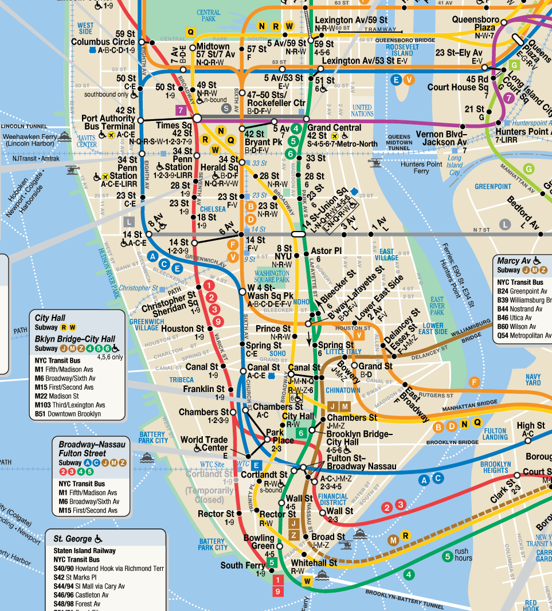

## **Introduction**

New York Subway system is one of the most intricate systems in the world. Here is an attempt to understand it through the lens of Manhattan Avenues and Streets.

## **Avenues**

### **Central Avenues**
| **Avenue Name**     | **Location**                       | **Description**                                         | **Notable Landmarks**                | **Subway Lines**        |
|---------------------|-------------------------------------|---------------------------------------------------------|---------------------------------------|-------------------------|
| **Broadway**         | Diagonal from Bowling Green to Inwood | Cuts through the grid, Manhattan’s most famous avenue.   | Times Square, Flatiron Building       | 1, 2, 3, N, Q, R, W    |
| **5th Avenue**       | Central dividing avenue            | Defines East/West numbering; luxury shopping corridor.   | Empire State Building, Central Park   | Closest subway: 6, N, R |
| **Park Avenue**      | East Side (Union Square to Harlem) | Affluent area with luxury buildings.                    | Grand Central Terminal, Park Avenue Viaduct | 4, 5, 6               |
| **Madison Avenue**   | Between 5th Ave and Park Ave       | Known for luxury boutiques and the advertising industry. | Madison Square Park                  | Closest subway: 6       |
| **Lexington Avenue** | East Side, parallel to Park Ave    | Major commercial and residential corridor.              | Chrysler Building                     | 4, 5, 6                |

### **West Side Avenues**
| **Avenue Name**       | **Location**                       | **Description**                                         | **Notable Landmarks**              | **Subway Lines**        |
|-----------------------|-------------------------------------|---------------------------------------------------------|-------------------------------------|-------------------------|
| **Central Park West**  | West of Central Park               | Scenic residential area along Central Park’s western edge. | American Museum of Natural History | A, C, B, D             |
| **Columbus Avenue**    | Continuation of 9th Avenue (Uptown) | Runs through the Upper West Side.                       | Lincoln Center                     | 1                      |
| **Amsterdam Avenue**   | Continuation of 10th Avenue (Uptown)| Primarily residential and commercial.                   | Cathedral of St. John the Divine   | 1                      |
| **West End Avenue**    | Continuation of 11th Avenue (Uptown)| Quiet residential area near the Hudson River.           | Riverside Park                     | No direct subway lines |
| **Riverside Drive**    | Westernmost residential avenue     | Scenic drive along the Hudson River.                    | Grant’s Tomb, Riverside Park       | Closest: 1 (Broadway)  |
| **12th Avenue**        | West Side Highway                  | Highway-like avenue, industrial in parts.               | Hudson River Greenway              | No subway lines        |

### **East Side Avenues**
| **Avenue Name**       | **Location**                       | **Description**                                         | **Notable Landmarks**             | **Subway Lines**        |
|-----------------------|-------------------------------------|---------------------------------------------------------|------------------------------------|-------------------------|
| **1st Avenue**         | Easternmost main avenue            | Major residential and commercial street.                | United Nations                    | Closest: 4, 5, 6       |
| **2nd Avenue**         | Parallel to 1st Avenue             | Residential and commercial, with the Second Avenue Subway. | Sutton Place                      | Q                      |
| **3rd Avenue**         | Parallel to 2nd Avenue             | Popular shopping and dining corridor.                   | Murray Hill, Kips Bay             | 4, 5, 6                |
| **FDR Drive**          | East River (highway-like)          | Runs along the East River, primarily for car traffic.    | East River Greenway               | No subway lines        |
| **Pleasant Avenue**    | East Harlem                       | Short, residential street with Italian-American heritage.| East Harlem                       | Closest: 6             |

### **Alphabet City Avenues**
| **Avenue Name**       | **Location**                       | **Description**                                         | **Notable Landmarks**             | **Subway Lines**        |
|-----------------------|-------------------------------------|---------------------------------------------------------|------------------------------------|-------------------------|
| **Avenue A**           | Alphabet City                     | Runs parallel to 1st Avenue.                            | Tompkins Square Park              | Closest: L             |
| **Avenue B**           | Alphabet City                     | Residential and community-oriented.                     | Community gardens                 | Closest: L             |
| **Avenue C**           | Alphabet City                     | Further east than Avenue B; residential and commercial. | East River Park                   | Closest: L             |
| **Avenue D**           | Alphabet City                     | Easternmost avenue in Alphabet City.                    | Community-focused                 | Closest: L             |

### **Special or Diagonal Avenues**
| **Avenue Name**       | **Location**                       | **Description**                                         | **Notable Landmarks**             | **Subway Lines**        |
|-----------------------|-------------------------------------|---------------------------------------------------------|------------------------------------|-------------------------|
| **Broadway**           | Diagonal from Bowling Green to Inwood | Cuts through the grid, Manhattan’s most famous avenue.   | Times Square, Broadway Theaters   | 1, 2, 3, N, Q, R, W    |
| **The Bowery**         | Diagonal from Chinatown to East Village | Historical street with modern cultural significance.     | Bowery Ballroom                   | J, Z, 6                |
| **Allen Street**       | Lower East Side                   | Connects the East Village and Lower East Side.          | F, M                              | F, M                   |
| **St. Nicholas Avenue**| Harlem and Washington Heights     | Runs diagonally through northern Manhattan.             | Historical landmarks in Harlem    | A, B, C, D             |
| **Edgecombe Avenue**   | Harlem and Washington Heights     | Runs along Highbridge Park, primarily residential.       | Highbridge Park                   | Closest: C, 1          |

## **Streets**

### **Downtown Streets**
| **Street Name**       | **Subway Lines**       | **Location**                     | **Key Features**                                     | **Notable Landmarks**                  |
|-----------------------|------------------------|-----------------------------------|-----------------------------------------------------|-----------------------------------------|
| **Wall Street**        | 2, 3, 4, 5            | Financial District               | Major financial hub of NYC.                         | New York Stock Exchange, Trinity Church |
| **Fulton Street**      | A, C, J, Z, 2, 3, 4, 5| Financial District to Lower Manhattan | Connects key subway lines in Downtown Manhattan.     | Fulton Center, World Trade Center      |
| **Canal Street**       | N, Q, R, W, J, Z, 6   | Chinatown                        | Major commercial street, hub for Chinatown and SoHo.| Manhattan Bridge entrance              |

### **Midtown Streets**
| **Street Name**       | **Subway Lines**       | **Location**                     | **Key Features**                                     | **Notable Landmarks**                  |
|-----------------------|------------------------|-----------------------------------|-----------------------------------------------------|-----------------------------------------|
| **42nd Street**        | 1, 2, 3, 4, 5, 6, 7, A, C, E, N, Q, R, W | Midtown                          | One of NYC's busiest streets, connecting east and west sides. | Grand Central Terminal, Times Square  |
| **34th Street**        | 1, 2, 3, B, D, F, M, N, Q, R, W | Midtown                          | Major shopping and transit corridor.                | Penn Station, Herald Square            |
| **14th Street**        | 1, 2, 3, F, M, L, A, C, E | West Village to Union Square      | Connects west to east, major transit hubs.          | Union Square, Chelsea Market           |

### **Uptown Streets**
| **Street Name**       | **Subway Lines**       | **Location**                     | **Key Features**                                     | **Notable Landmarks**                  |
|-----------------------|------------------------|-----------------------------------|-----------------------------------------------------|-----------------------------------------|
| **125th Street**       | 1, 2, 3, A, B, C, D, 4, 5, 6 | Harlem                           | Main commercial street of Harlem.                   | Apollo Theater, Harlem Markets         |
| **145th Street**       | A, B, C, D, 1, 3        | Harlem                           | Serves as a central transit hub for upper Harlem.    | Jackie Robinson Park                   |

### **Special/Diagonal Streets**
| **Street Name**       | **Subway Lines**       | **Location**                     | **Key Features**                                     | **Notable Landmarks**                  |
|-----------------------|------------------------|-----------------------------------|-----------------------------------------------------|-----------------------------------------|
| **Houston Street**     | 1, 2, 3, A, C, E      | Lower Manhattan                  | Divides SoHo and Greenwich Village.                 | Katz's Delicatessen, SoHo shopping     |
| **Delancey Street**     | F, M, J, Z            | Lower East Side                  | Major connector between Williamsburg Bridge and Manhattan. | Essex Market, Williamsburg Bridge     |

