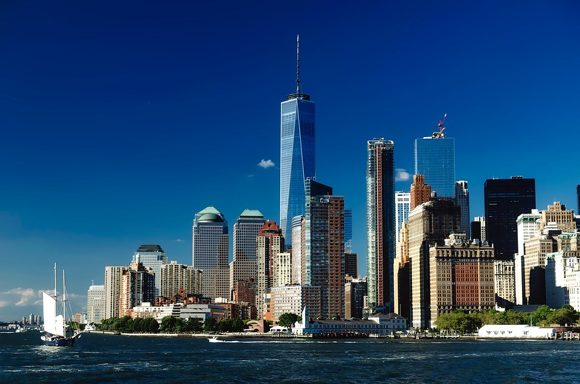
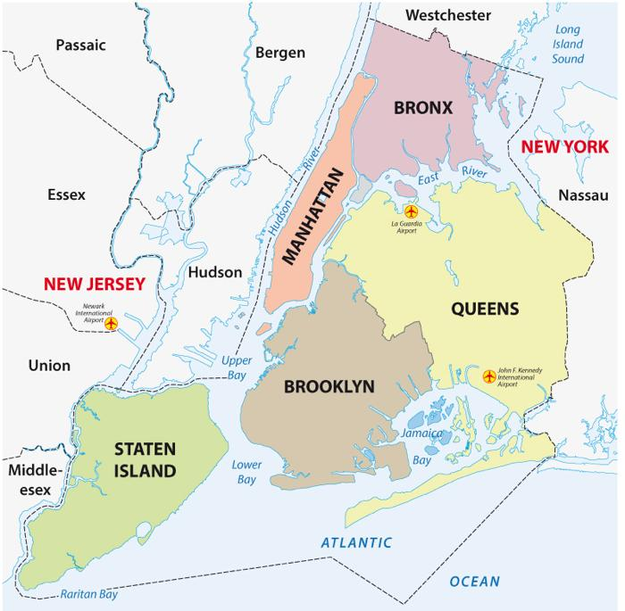

## **New York, New York - a city so cool that it has been named twice!**

New York City (NYC) is the largest city in the United States and one of the most iconic urban centers in the world. Known as "The Big Apple/Gotham," it is a global hub for culture, finance, media, and entertainment. NYC is composed of five boroughs, each with its unique characteristics and charm. Together, these boroughs cover an area of about **302.6 square miles (783.8 km²)** and are home to over **8.8 million people**.

### **The Five Boroughs of New York City**

- **Manhattan** – the world’s most famous island, where dreams come alive!
- **Brooklyn** – where creativity thrives and the vibe is always cool!
- **Queens** – NYC’s melting pot, where flavors and faces from around the globe unite!
- **Bronx** – where legends are born and the community shines!
- **Staten Island** – NYC’s serene escape, where nature takes the spotlight!

| **Borough**     | **County**       | **Population** | **Area (sq mi)** | **Key Features**                                                                 | **Notable Landmarks**                         |
|------------------|------------------|----------------|------------------|----------------------------------------------------------------------------------|-----------------------------------------------|
| **Manhattan**    | New York County  | 1.63 million   | 22.7            | The financial and cultural center, home to Wall Street, Central Park, and Broadway. | Empire State Building, Times Square, Wall Street |
| **Brooklyn**     | Kings County     | 2.73 million   | 69.5            | Known for its vibrant arts scene, historic neighborhoods, and iconic Brooklyn Bridge. | Brooklyn Bridge, Prospect Park, Coney Island  |
| **Queens**       | Queens County    | 2.4 million    | 108.7           | NYC's most diverse borough, known for its ethnic enclaves, parks, and major airports. | Flushing Meadows-Corona Park, Citi Field      |
| **The Bronx**    | Bronx County     | 1.47 million   | 42.2            | Birthplace of hip-hop and home to Yankee Stadium and the Bronx Zoo.               | Yankee Stadium, Bronx Zoo, New York Botanical Garden |
| **Staten Island**| Richmond County  | 495,000        | 57.5            | Suburban feel, Staten Island Ferry, and the Staten Island Greenbelt.             | Staten Island Ferry, Staten Island Greenbelt  |

### **NYC Quick Facts**
- **Founded:** 1624 (as New Amsterdam)
- **Nicknames:** The Big Apple, Gotham
- **Population:** Over 8.8 million (2020 Census)
- **Languages:** Over 200 languages spoken
- **Economy:** One of the largest in the world, driven by finance, technology, media, and tourism
- **Landmarks:** Empire State Building, Statue of Liberty, Times Square, and more

---

