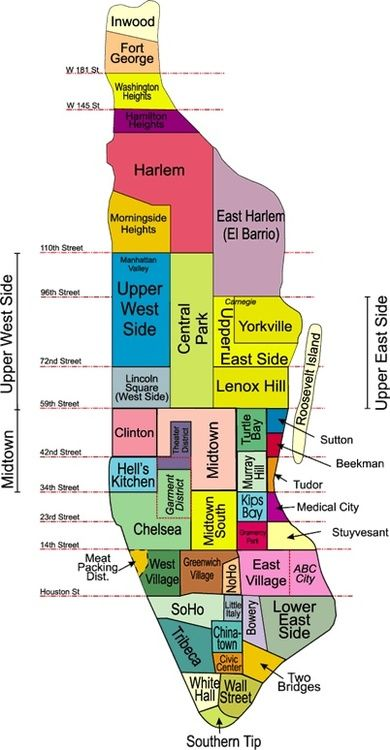

## **New York, New York - a city so cool that it has been named twice!**

New York City (NYC) is the largest city in the United States and one of the most iconic urban centers in the world. Known as "The Big Apple/Gotham," it is a global hub for culture, finance, media, and entertainment. NYC is composed of five boroughs, each with its unique characteristics and charm. Together, these boroughs cover an area of about **302.6 square miles (783.8 km²)** and are home to over **8.8 million people**.

### **The Five Boroughs of New York City**

- **Manhattan** – the world’s most famous island, where dreams come alive!
- **Brooklyn** – where creativity thrives and the vibe is always cool!
- **Queens** – NYC’s melting pot, where flavors and faces from around the globe unite!
- **Bronx** – where legends are born and the community shines!
- **Staten Island** – NYC’s serene escape, where nature takes the spotlight!

| **Borough**     | **County**       | **Population** | **Area (sq mi)** | **Key Features**                                                                 | **Notable Landmarks**                         |
|------------------|------------------|----------------|------------------|----------------------------------------------------------------------------------|-----------------------------------------------|
| **Manhattan**    | New York County  | 1.63 million   | 22.7            | The financial and cultural center, home to Wall Street, Central Park, and Broadway. | Empire State Building, Times Square, Wall Street |
| **Brooklyn**     | Kings County     | 2.73 million   | 69.5            | Known for its vibrant arts scene, historic neighborhoods, and iconic Brooklyn Bridge. | Brooklyn Bridge, Prospect Park, Coney Island  |
| **Queens**       | Queens County    | 2.4 million    | 108.7           | NYC's most diverse borough, known for its ethnic enclaves, parks, and major airports. | Flushing Meadows-Corona Park, Citi Field      |
| **The Bronx**    | Bronx County     | 1.47 million   | 42.2            | Birthplace of hip-hop and home to Yankee Stadium and the Bronx Zoo.               | Yankee Stadium, Bronx Zoo, New York Botanical Garden |
| **Staten Island**| Richmond County  | 495,000        | 57.5            | Suburban feel, Staten Island Ferry, and the Staten Island Greenbelt.             | Staten Island Ferry, Staten Island Greenbelt  |

### **NYC Quick Facts**
- **Founded:** 1624 (as New Amsterdam)
- **Nicknames:** The Big Apple, Gotham
- **Population:** Over 8.8 million (2020 Census)
- **Languages:** Over 200 languages spoken
- **Economy:** One of the largest in the world, driven by finance, technology, media, and tourism
- **Landmarks:** Empire State Building, Statue of Liberty, Times Square, and more

---

## **Manhattan – the island that never sleeps, where dreams reach for the sky!**

Manhattan is the heart of New York City, known for its iconic skyline, vibrant neighborhoods, and central role in finance, arts, and culture. Often considered the city’s cultural and economic hub, Manhattan is home to world-famous landmarks like Times Square, Central Park, and Wall Street. It is divided into numerous neighborhoods, each with its own distinct character and charm.

### **Table of Manhattan Neighborhoods**

| **Neighborhood**         | **Key Features**                                                                                      | **Notable Landmarks**                       |
|---------------------------|------------------------------------------------------------------------------------------------------|---------------------------------------------|
| **Harlem**                | Known for its rich African-American culture, jazz music, and historic brownstones.                  | Apollo Theater, Marcus Garvey Park          |
| **East Harlem (El Barrio)**| Famous for its Hispanic heritage and vibrant murals.                                                | Museum of the City of New York              |
| **Upper West Side**       | Residential area with cultural landmarks and proximity to Central Park.                             | American Museum of Natural History          |
| **Upper East Side**       | Affluent area with luxury apartments and museums.                                                   | The Met, Guggenheim Museum                  |
| **Midtown**               | Commercial core with iconic skyscrapers and busy avenues.                                           | Empire State Building, Rockefeller Center   |
| **Hell’s Kitchen**        | Known for its trendy restaurants and theater culture.                                               | Intrepid Sea, Air & Space Museum            |
| **Chelsea**               | Artistic hub with galleries and modern developments.                                                | Chelsea Market, High Line                   |
| **SoHo**                  | Trendy shopping district with cast-iron architecture.                                               | Designer boutiques, art galleries           |
| **Lower East Side**       | Historically immigrant-rich area, now known for nightlife and dining.                               | Tenement Museum                             |
| **Wall Street / Financial District** | Global financial center, home to the stock exchange and historic sites.                               | New York Stock Exchange, One World Trade Center |
| **Chinatown**             | Bustling area with authentic Chinese cuisine and shops.                                             | Canal Street                                |
| **Little Italy**          | Known for Italian-American heritage and annual feasts.                                              | Mulberry Street, Feast of San Gennaro       |
| **Inwood**                | Quiet residential area with parks and a historic past.                                              | Dyckman Farmhouse Museum, Inwood Hill Park  |

### **Manhattan Grid System**

The **Manhattan Grid System** is a planned urban layout designed to simplify navigation and optimize the use of land in Manhattan, New York City. Adopted in 1811 as part of the Commissioners' Plan, it is one of the most famous examples of urban planning.

### **Key Features of the Grid System**

1. **North-South Streets:**
   - Streets run horizontally and are numbered sequentially from south to north.
   - Most streets are laid out in a regular, parallel pattern.
   - The blocks between streets are relatively uniform, with each block spanning approximately **264 feet (~80 meters)**.

2. **East-West Avenues:**
   - Avenues run vertically and are spaced farther apart than streets.
   - Avenues are also numbered, starting from 1st Avenue on the east side and moving westward.
   - The distance between avenues averages **750 to 920 feet (~244 to 280 meters)**.

3. **Neighborhood Variations:**
   - **Downtown Manhattan (below 14th Street):** The grid system is less regular, with winding streets that reflect earlier, unplanned urban development.
   - **Midtown and Uptown Manhattan (above 14th Street):** The grid becomes highly consistent, making navigation straightforward.

4. **Exceptions:**
   - Certain streets, like Broadway, cut diagonally through the grid, creating iconic intersections such as Times Square.
   - Some streets, like Park Avenue and Central Park West, have specific names instead of numbers.

### **Practical Benefits of the Grid System**
- **Ease of Navigation:** The consistent numbering of streets and avenues makes finding locations intuitive.
- **Scalability:** The system allowed Manhattan to grow rapidly while maintaining order.
- **Distance Estimation:** The uniformity of block lengths allows for easy estimation of distances:
  - 20 street blocks (north-south) ≈ 1 mile.
  - ~6 avenue blocks (east-west) ≈ 1 mile.

### **Cultural and Historical Significance**
- The grid system symbolizes New York City's efficiency and practicality.
- It reflects the foresight of planners who anticipated the city's rapid growth.
- Iconic landmarks, such as Central Park, fit seamlessly within the grid.

### **Distance Table: Manhattan Grid System**

| **Type of Distance**         | **US System (feet)** | **US System (miles)** | **Metric System (meters)** | **Metric System (kilometers)** |
|-------------------------------|----------------------|------------------------|----------------------------|---------------------------------|
| **Distance Between Streets**  | ~264 feet           | ~0.05 miles           | ~80 meters                 | ~0.08 kilometers               |
| **Distance Between Avenues**  | ~800 feet           | ~0.15 miles           | ~244 meters                | ~0.24 kilometers               |
| **1 Mile (North-South)**      | 20 street blocks    | 1 mile                | ~1,609 meters              | 1.609 kilometers               |
| **1 Mile (East-West)**        | ~6 avenue blocks    | 1 mile                | ~1,609 meters              | 1.609 kilometers               |

### **Distance calculation examples**

1. **From 34th Street to 42nd Street** (North-South)
   - **Distance in blocks:** \(42 - 34 = 8\) blocks
   - **US System:** \(8 \times 264 = 2,112 \, \text{feet} = 0.4 \, \text{miles}\)
   - **Metric System:** \(8 \times 80 = 640 \, \text{meters} = 0.64 \, \text{kilometers}\)

2. **From 5th Avenue to 8th Avenue** (East-West)
   - **Distance in blocks:** \(8 - 5 = 3\) avenues
   - **US System:** \(3 \times 800 = 2,400 \, \text{feet} = 0.45 \, \text{miles}\)
   - **Metric System:** \(3 \times 244 = 732 \, \text{meters} = 0.73 \, \text{kilometers}\)
