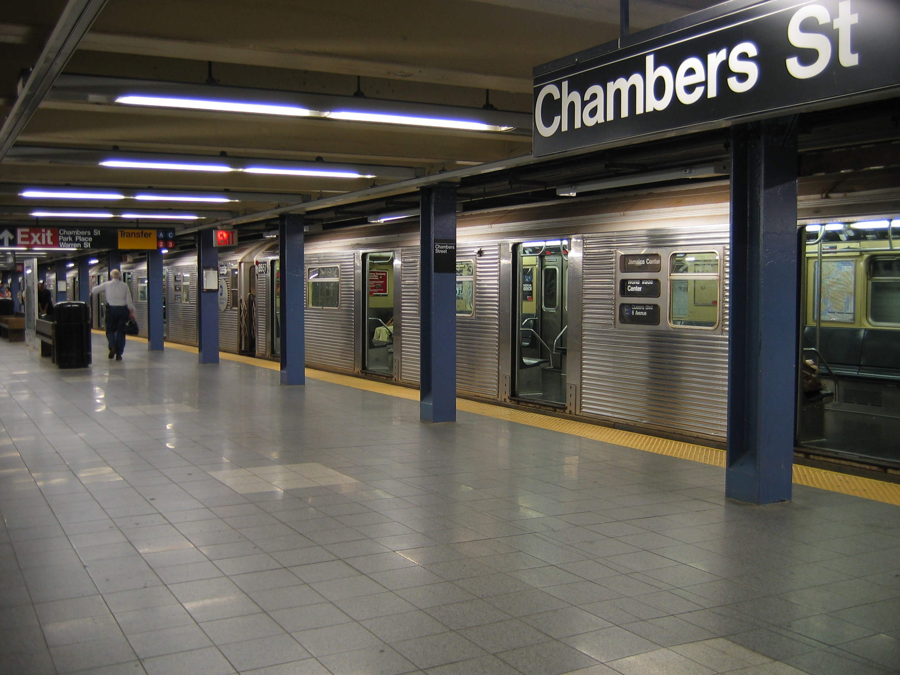
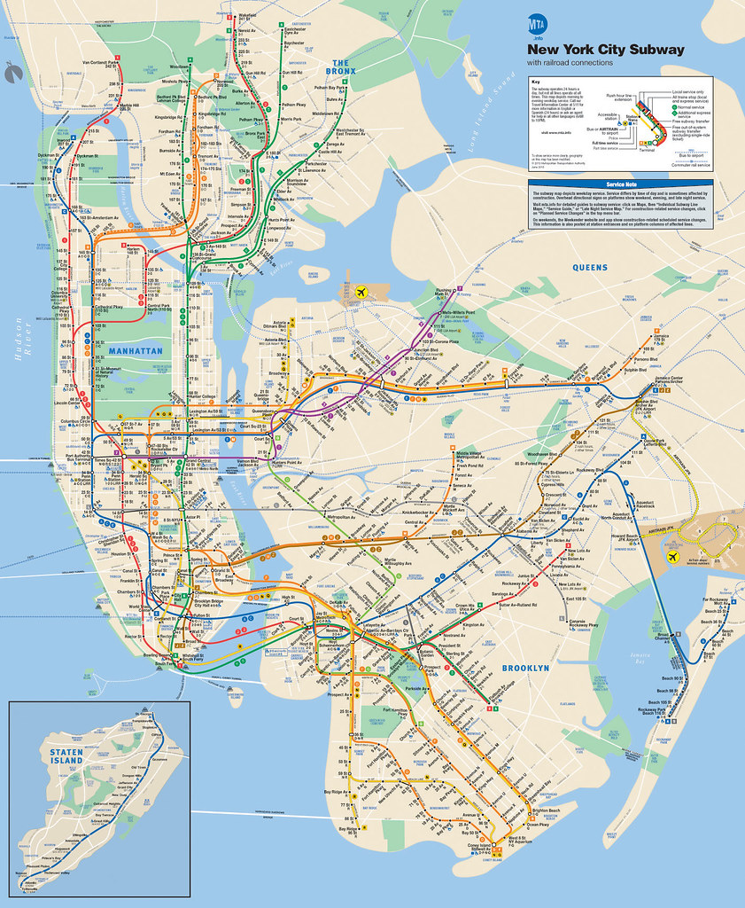

## **Overview of the NYC Subway System**

The New York City Subway, operated by the **Metropolitan Transportation Authority (MTA)**, is one of the largest and most complex public transit systems in the world. It is renowned for its extensive network, 24/7 service, and critical role in connecting the city's five boroughs.

### **Key Facts**
- **Opened:** October 27, 1904  
- **Total Length:** Approximately **665 miles** of track (in use)  
- **Lines:** **36 subway lines** across the city, identified by numbers (1-7) or letters (A-Z).  
- **Stations:** **472 stations**, making it the subway system with the most stations globally.  
- **Ridership:** Millions of riders use the system daily, with annual ridership exceeding **1 billion passengers** (pre-pandemic).  
- **Operating Hours:** The NYC Subway operates 24 hours a day, 7 days a week.

### **System Layout**
1. **Manhattan:** The hub of the subway system, where most lines converge, serving both local and express services. Key hubs include **Times Square-42nd Street**, **Grand Central Terminal**, and **Herald Square**.
2. **Brooklyn:** Connected to Manhattan via multiple lines, serving neighborhoods like **Downtown Brooklyn**, **Williamsburg**, and **Coney Island**.
3. **Queens:** Features key transit hubs like **Queensboro Plaza** and **Jamaica Center**, with service to JFK Airport.
4. **The Bronx:** Connected primarily by the numbered lines (1, 2, 4, 5, 6), serving areas like **Yankee Stadium** and **Fordham Road**.
5. **Staten Island:** Served by the **Staten Island Railway** (SIR), which connects Staten Island to the Staten Island Ferry terminal.

### **Types of Services**
- **Local Trains:** Stop at every station on the line.
- **Express Trains:** Skip certain stations to offer faster service, particularly during peak hours.
- **Shuttle Services:** Short train routes connecting key stations (e.g., **42nd Street Shuttle**).

### **Notable Features**
- **Color-Coded Routes:** Lines are grouped by colors based on their trunk line in Manhattan (e.g., Red for 1/2/3, Green for 4/5/6).
- **Accessibility:** Many stations now feature elevators and ramps, but a significant number remain inaccessible to passengers with mobility challenges.
- **Integrated Payment System:** The transition from the **MetroCard** to the **OMNY contactless payment system** is currently underway.
- **Express Tracks:** Many lines have dedicated express tracks, particularly in Manhattan and Brooklyn.

### **Interesting Facts**
1. **Longest Line:** The A train, running 31 miles from Inwood-207th Street in Manhattan to Far Rockaway in Queens.
2. **Busiest Station:** Times Square-42nd Street, serving over 60 million passengers annually.
3. **Deepest Station:** 191st Street (1 train) in Washington Heights, located about 180 feet below street level.
4. **Oldest Station:** City Hall, a now-closed but preserved station that opened in 1904.
5. **Artwork:** Many stations feature public art as part of the **MTA Arts & Design program**.

---

## **Subway  Lines**

### **Numbered Lines (1–7)**

| **Line** | **Color**    | **Route**                                     | **Key Stations**                           | **Type**       |
|----------|--------------|-----------------------------------------------|--------------------------------------------|----------------|
| 1        | Red          | South Ferry (Manhattan) ↔ Van Cortlandt Park (Bronx) | Times Square, 125th St                     | Local          |
| 2        | Red          | Flatbush Ave (Brooklyn) ↔ Wakefield-241st St (Bronx) | Times Square, 149th St-Grand Concourse     | Express        |
| 3        | Red          | New Lots Ave (Brooklyn) ↔ Harlem-148th St (Manhattan) | Times Square, Fulton St                    | Express        |
| 4        | Green        | Crown Heights-Utica Ave (Brooklyn) ↔ Woodlawn (Bronx) | Grand Central, 125th St                    | Express        |
| 5        | Green        | Flatbush Ave (Brooklyn) ↔ Eastchester-Dyre Ave (Bronx) | Grand Central, Fulton St                   | Express        |
| 6        | Green        | Brooklyn Bridge (Manhattan) ↔ Pelham Bay Park (Bronx) | Grand Central, 125th St                    | Local          |
| 7        | Purple       | Flushing-Main St (Queens) ↔ Hudson Yards (Manhattan) | Times Square, Grand Central                | Local/Express  |

### **Lettered Lines (A–G)**

| **Line** | **Color**    | **Route**                                     | **Key Stations**                           | **Type**       |
|----------|--------------|-----------------------------------------------|--------------------------------------------|----------------|
| A        | Blue         | Inwood-207th St (Manhattan) ↔ Far Rockaway (Queens) | Times Square, Fulton St                    | Local/Express  |
| C        | Blue         | 168th St (Manhattan) ↔ Euclid Ave (Brooklyn)   | Times Square, Fulton St                    | Local          |
| E        | Blue         | World Trade Center (Manhattan) ↔ Jamaica Center (Queens) | Times Square, Lexington Ave-53rd St        | Express        |
| B        | Orange       | Bedford Park Blvd (Bronx) ↔ Brighton Beach (Brooklyn) | Times Square, Grand St                     | Local/Express  |
| D        | Orange       | Norwood-205th St (Bronx) ↔ Coney Island (Brooklyn) | Times Square, Atlantic Ave-Barclays Center | Local/Express  |
| F        | Orange       | Jamaica-179th St (Queens) ↔ Coney Island (Brooklyn) | Times Square, 14th St-Union Square         | Local/Express  |
| M        | Orange       | Forest Hills-71st Ave (Queens) ↔ Middle Village (Queens) | Rockefeller Center, Delancey St            | Local          |
| G        | Light Green  | Court Sq (Queens) ↔ Church Ave (Brooklyn)      | Bedford-Nostrand, Hoyt-Schermerhorn        | Local          |

### **Shuttle and Special Lines**

| **Line** | **Color**    | **Route**                                     | **Key Stations**                           | **Type**       |
|----------|--------------|-----------------------------------------------|--------------------------------------------|----------------|
| S (42nd St Shuttle) | Gray  | Times Square ↔ Grand Central                | Times Square, Grand Central                | Shuttle        |
| Franklin Ave Shuttle  | Gray  | Franklin Ave ↔ Prospect Park               | Franklin Ave                               | Shuttle        |
| Rockaway Park Shuttle | Gray  | Broad Channel ↔ Rockaway Park-Beach 116th St | Broad Channel                              | Shuttle        |

---

## **Relationship Between Numbering and Color Coding**

1. **Color Coding:**
   - Each color represents a **trunk line** (a central route shared by multiple services) in Manhattan.
   - For example:
     - **Red**: The 1, 2, and 3 trains all use the **Broadway–Seventh Avenue Line** in Manhattan.
     - **Green**: The 4, 5, and 6 trains all use the **Lexington Avenue Line** in Manhattan.
   - This helps passengers identify which trains follow similar paths through central areas of the city.

2. **Numbering (or Lettering):**
   - Each number or letter represents a **specific service** (a distinct route with defined stops and endpoints) that operates on a trunk line.
   - For example:
     - The **1** train runs local, while the **2** and **3** trains run express on the same red-colored trunk line.

3. **Combining Color and Numbering:**
   - The color provides a high-level guide to the trunk line.
   - The number or letter distinguishes between local, express, or unique routes on that trunk.

### **Key Examples**

| **Color**   | **Number/Letter** | **Trunk Line**                           | **Service Notes**                              |
|-------------|--------------------|------------------------------------------|-----------------------------------------------|
| **Red**     | 1, 2, 3            | Broadway–Seventh Avenue Line             | 1 is local, 2 and 3 are express.              |
| **Green**   | 4, 5, 6            | Lexington Avenue Line                    | 6 is local, 4 and 5 are express.              |
| **Blue**    | A, C, E            | Eighth Avenue Line                       | A is express, C is local, E serves Queens.    |
| **Orange**  | B, D, F, M         | Sixth Avenue Line                        | Services split after Manhattan.               |
| **Yellow**  | N, Q, R, W         | Broadway Line                            | N and Q are express, R and W are local.       |
| **Purple**  | 7                  | Flushing Line                            | 7 offers local and express services.          |
| **Gray**    | S (Shuttle)        | Varies (e.g., 42nd St, Franklin Ave)     | Short-distance shuttle routes.                |

### **How Color and Numbering Help Passengers**

- **Color**:
  - Guides passengers to the trunk line, useful for navigating **Manhattan** where many lines converge.
  - Example: All green trains (4, 5, 6) run along Lexington Avenue.
  
- **Number/Letter**:
  - Helps passengers distinguish specific services on the same line.
  - Example: The **1** stops at all local stations on the red line, but the **2** skips certain stops as an express.

### **Why This System is Effective**

The dual-use of color coding for trunk lines and numbers/letters for specific services:

1. Reduces confusion in complex areas with overlapping routes (like Midtown Manhattan).
2. Allows flexibility for service adjustments (e.g., express or local changes) without altering the overall color-coded map.

---